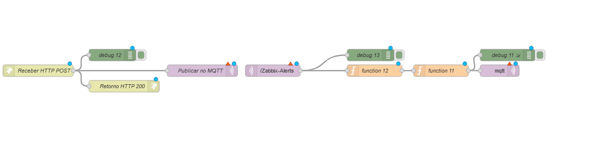
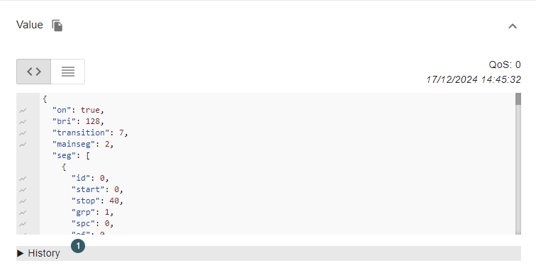

# Projeto de Monitoramento de Racks de Datacenter com LED

Este projeto implementa um sistema de monitoramento de racks de datacenter utilizando ESP32 com o firmware WLED para controle de LEDs, Node-RED para processamento de mensagens e Zabbix para o monitoramento de alertas. A ideia é exibir o status de cada rack (em forma de LED) de acordo com os alertas recebidos do Zabbix, utilizando uma interface MQTT para comunicação entre os componentes.

## Arquitetura

- **ESP32 com Firmware WLED**: Cada rack de datacenter é equipado com um ESP32 que controla as luzes LED (RGB) baseadas nos alertas recebidos.
- **Zabbix**: Ferramenta de monitoramento de infraestrutura que envia alertas via HTTP POST para o Node-RED.
- **Node-RED**: Plataforma de automação e integração que recebe os alertas do Zabbix, processa as informações e controla os LEDs dos racks via MQTT.
- **MQTT**: Protocolo de mensagens leve utilizado para comunicação entre o Node-RED e os dispositivos ESP32.

## Fluxo de Dados

1. **Zabbix** envia um alerta via HTTP POST para o Node-RED com os seguintes parâmetros:
    - **Grupo**: Nome do rack (ex: Rack 1, Rack 2, etc.)
    - **Alerta**: Nível de alerta (ex: Warning, High, Average)
    - **Status**: Status do alerta (ex: PROBLEM ou OK)

2. **Node-RED** recebe o alerta, processa os dados e envia as informações para o ESP32 do rack correspondente via MQTT.
3. O **ESP32 com WLED** recebe as configurações de cor e brilho para os LEDs e ajusta o ambiente de acordo com o nível de alerta.

## Tecnologias Utilizadas

- **Node-RED**: Ferramenta de automação e integração de fluxos.
- **Zabbix**: Sistema de monitoramento e geração de alertas.
- **MQTT**: Protocolo de mensagens leve e eficiente para comunicação entre sistemas.
- **ESP32**: Microcontrolador utilizado para controle de LEDs via firmware WLED.
- **WLED**: Firmware que permite o controle de LEDs RGB.

## Como Funciona

Quando um alerta é disparado no Zabbix, ele é enviado via HTTP POST para o Node-RED. O Node-RED processa a mensagem, verificando o grupo (rack), o nível de alerta e o status do alerta. Com base nessas informações, ele publica um comando MQTT para o ESP32, que então altera o estado da luz LED no rack correspondente.

## Como Rodar

### Requisitos

- Node-RED instalado e configurado.
- Zabbix configurado para enviar alertas via HTTP.
- Broker MQTT (por exemplo, Mosquitto) configurado.
- ESP32 com firmware WLED instalado e configurado para receber comandos MQTT.

### Passos

1. Instale e configure o Node-RED.
2. Importe o fluxo do Node-RED fornecido.
3. Configure o Zabbix para enviar alertas para o Node-RED.
4. Configure o ESP32 com o firmware WLED para receber comandos MQTT.
5. Teste o sistema gerando alertas no Zabbix e verificando a resposta no controle dos LEDs dos racks.

## Imagens

1. **Fluxo no Node-RED**: 

   

2. **Exemplo de Payload Recebido pelo Zabbix**:

   

3. **Exemplo de Payload Enviado para o WLED**:

   

4. **Vídeo de Funcionamento**:

   https://github.com/user-attachments/assets/4aa747e3-ba39-45ff-afe3-415bcb0fe829

## Licença

Este projeto está licenciado sob a [MIT License](LICENSE).

## Tags

 
 

